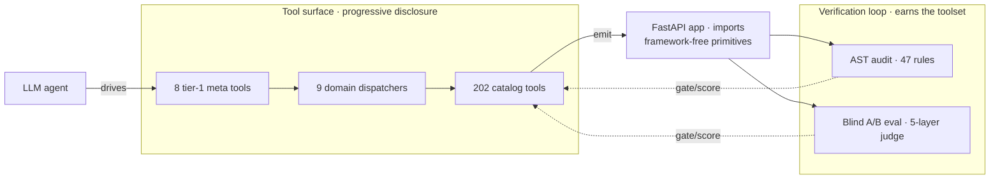

# HuGR Arsenal

**Executable knowledge an LLM agent invokes to scaffold *and* customize
production FastAPI backends — plus a harness that proves the agent writes
better code with the toolset than without it.**

Most "AI code generation" is a prompt and a hope. This is the opposite: a
tool surface an agent drives through a disciplined MCP interface, a library
of framework-free building blocks the generated code imports from, and a
**blind A/B evaluation harness** that runs the same agent with and without
the toolset and scores the emitted apps under concurrency and chaos. The
toolset earns its place by measurement, not assertion.

Built by orchestrating a fleet of code agents under a quality contract — see
[**docs/HOW_I_BUILT_THIS.md**](docs/HOW_I_BUILT_THIS.md).

## The idea in one diagram



Rails-style three layers: a **macro scaffold** (the skill) lays the project
down, **slice generators** add capabilities, and **primitives** (a
framework-free library the agent composes) keep the output hand-editable.

## What makes it real, not a demo

- **Blind A/B eval harness** (`engine/bench/blind/`, ~2.6k LOC) — drives a live
  agent *naked* vs *kit*, boots each emitted app on an ephemeral port, judges
  it across five sealed layers (functional · property · concurrency · chaos ·
  static-AST). Resumable, seed-controlled, concurrent; harvests SFT/DPO pairs.
- **Progressive-disclosure MCP surface** (`mcp_tools/`) — 202 tools would drown
  an agent (tool-use degrades past ~30–50), so it sees 8 tier-1 metas and
  narrows through 9 dispatchers. Auto-discovered from a `MCP_TOOL` convention.
- **AST contract audit** (`engine/audit/`) — 47 machine-checked rules gate every
  change (no module-level state, init inside lifespan, authed admin routes, …).
- **Governed promotion** (`engine/promotion/`) — atomic backup → promote →
  re-verify → auto-rollback, with a human-reviewable ledger.

## Try it

```bash
# a self-contained example that proves the invariants of a generated app
cd examples/01-todos-crud
python -m pytest -q          # owner-scoping + keyset pagination, green
```

Each of the 20 [`examples/`](examples/) is an agent-built illustration tied to
a benchmark spec, with the `AGENT_SESSION.md` transcript that built it; the
full production scaffold comes from `fastapi_generate_project` + the `add_*`
tools. The blind A/B harness runs via
`python -m engine.bench.blind.runner` (see [docs/DEMO.md](docs/DEMO.md)).

## By the numbers (machine-verified)

Regenerate with `python -m engine.inventory`; every doc reconciles against
[`INVENTORY.md`](INVENTORY.md) or the audit fails.

```
Tools:      219 (202 catalog + 8 tier-1 + 9 tree)   Contract: 47/47 green
Primitives: 124 (registered)   Staged: 175 (+41 quarantined)
Examples:    20 agent-built apps · 18 FastAPI adapters · Benchmark 100.00
```

```
core/venous/     # 124 primitives + 18 FastAPI adapters
adapt/           # 135 tools (105 extend + 30 other)
generators/      # 61 macro scaffold helpers
mcp_tools/       # MCP server + 8 tier-1 metas + 9 tree dispatchers
engine/          # audit · blind eval · promotion · extraction · inventory
```

## More

- [docs/HOW_I_BUILT_THIS.md](docs/HOW_I_BUILT_THIS.md) — the agent-orchestration story
- [PRODUCT.md](PRODUCT.md) · [CONTRACT.md](CONTRACT.md) · [core/venous/README.md](core/venous/README.md) · [ROADMAP.md](ROADMAP.md)
- Install: `curl -fsSL https://raw.githubusercontent.com/humangr-labs/HuGR-Arsenal/main/install.sh | bash`

**Status is not marketing** — every claim maps to a code location or a machine
count; claim-vs-reality drift is a bug fixed the day it's found.

Built and maintained by Gustavo Schneiter.
