# Work Breakdown Structure: claude-gateway

**Total WPs**: 9 (6 parallelizable backends + 3 sequential integration)  
**Estimated Effort**: ~6-8h wall time with 3 agents  
**Parallelization**: WP1+WP2+WP3+WP4+WP5+WP6 independent → WP7 (router/fallback) → WP8 (discovery) → WP9 (validation)

---

## Backend Classification

| Backend | Type | Translation | WP | Reuses |
|---------|------|-------------|----|--------|
| OpenRouter | Pass-through | Zero | WP2 | — |
| Groq | OpenAI-compat | Thin (Anthropic↔OpenAI) | WP3 | `translators/openai.py`, `translators/tool_schema.py` |
| Google AI Studio (Gemini) | Gemini API | Thin (Anthropic↔Gemini) | WP4 | `translators/gemini.py`, `translators/tool_schema.py` |
| NVIDIA NIM | OpenAI-compat | Thin (Anthropic↔OpenAI) | WP5 | `translators/openai.py`, `translators/tool_schema.py` |
| Mistral | OpenAI-compat | Thin (Anthropic↔OpenAI) | WP6 | `translators/openai.py`, `translators/tool_schema.py` |
| opencode-bridge | OpenAI-compat | Thin (Anthropic↔OpenAI) | WP6b | `translators/openai.py`, `translators/tool_schema.py` |

**Shared modules** (built in WP3/WP4, reused by WP5/WP6/WP6b):
- `gateway/translators/openai.py` — Anthropic↔OpenAI request/response + SSE
- `gateway/translators/gemini.py` — Anthropic↔Gemini request/response + SSE
- `gateway/translators/tool_schema.py` — Anthropic tools ↔ OpenAI functions ↔ Gemini functionDeclarations

---

## WP1: Gateway Core Skeleton (FastAPI + Discovery Stub)
**Owner**: Agent A  
**Dependencies**: None  
**Deliverable**: `gateway/main.py` + `gateway/config.py` + `gateway/router.py` (stubs) + `gateway/health.py`

**Tasks**:
- [ ] FastAPI app with lifespan (startup/shutdown)
- [ ] `GET /v1/models` endpoint returning hardcoded discovery payload (IDs with `claude` substring)
- [ ] `GET /health` endpoint (checks all backends + bridge instances)
- [ ] Config loader: env vars + `gateway_config.yaml` (pydantic-settings)
- [ ] Structured logging (structlog or stdlib json)
- [ ] Router stub: `route(model) -> backend_name`
- [ ] Unit test: discovery returns expected IDs; health checks each backend

**Acceptance**: `curl localhost:8787/v1/models` returns valid JSON with `claude-*` IDs; `/health` returns status per backend.

---

## WP2: OpenRouter Pass-Through Backend
**Owner**: Agent B  
**Dependencies**: None  
**Deliverable**: `gateway/backends/openrouter.py`

**Tasks**:
- [ ] `async def forward(request: Request) -> StreamingResponse`
- [ ] Extract `model` from request body, rewrite via `openrouter_model_map`
- [ ] Forward `POST /v1/messages` to `OPENROUTER_BASE_URL/v1/messages` with `Authorization: Bearer $OPENROUTER_API_KEY`
- [ ] Relay SSE stream **byte-for-byte** (no parsing, no buffering)
- [ ] Propagate `x-claude-code-session-id`, `x-claude-code-agent-id` headers
- [ ] Error mapping: 4xx/5xx → Anthropic-format error response
- [ ] Unit test: mock httpx, verify passthrough + header propagation

**Acceptance**: `curl -X POST localhost:8787/v1/messages -d '{"model":"claude-openrouter-opus-5",...}'` streams OpenRouter SSE.

---

## WP3: Groq Translation Backend (Builds Shared OpenAI Translator)
**Owner**: Agent C  
**Dependencies**: None  
**Deliverable**: `gateway/backends/groq.py` + `gateway/translators/openai.py` + `gateway/translators/tool_schema.py`

**Tasks**:
- [ ] `async def translate_and_forward(request: Request) -> StreamingResponse`
- [ ] Extract model: strip `claude-groq-` prefix, map via `groq_model_map`
- [ ] **Build `translators/openai.py`**:
  - `anthropic_to_openai(messages, tools) -> (openai_messages, openai_functions)`
  - `openai_sse_to_anthropic(line) -> SSEEvent | None` (handles buffered tool_calls reconstruction)
  - `normalize_error(response) -> AnthropicError`
- [ ] **Build `translators/tool_schema.py`**:
  - `anthropic_tool_to_openai_function(tool) -> dict`
  - `anthropic_tool_to_gemini_declaration(tool) -> dict`
  - Handles: required fields, type mapping (any → object), enum, array items
- [ ] POST to `https://api.groq.com/openai/v1/chat/completions` with `Authorization: Bearer $GROQ_API_KEY`
- [ ] Use shared translators for request/response conversion
- [ ] Emit keep-alive `:` pings every 30s (background task)
- [ ] Rate-limit header passthrough (`retry-after`, `x-ratelimit-remaining`)
- [ ] Unit test: mock httpx, verify translation round-trip + tool schema mapping

**Acceptance**: Groq backend streams text + tool calls correctly mapped; shared translators work standalone.

---

## WP4: Google AI Studio (Gemini) Translation Backend (Builds Shared Gemini Translator)
**Owner**: Agent D  
**Dependencies**: None  
**Deliverable**: `gateway/backends/gemini.py` + `gateway/translators/gemini.py`

**Tasks**:
- [ ] `async def translate_and_forward(request: Request) -> StreamingResponse`
- [ ] Extract model: strip `claude-gemini-` prefix, map via `gemini_model_map`
- [ ] **Build `translators/gemini.py`**:
  - `anthropic_to_gemini(messages, tools) -> gemini_request_body`
  - `gemini_sse_to_anthropic(line) -> SSEEvent | None` (handles functionCall reconstruction)
  - `normalize_error(response) -> AnthropicError`
- [ ] Reuse `translators/tool_schema.py` for `anthropic_tool_to_gemini_declaration`
- [ ] POST to `https://generativelanguage.googleapis.com/v1beta/models/{model}:streamGenerateContent?key=$GEMINI_API_KEY`
- [ ] Use shared translators for request/response conversion
- [ ] Local rate limiting: enforce 15 RPM (token bucket) before forwarding
- [ ] Rate-limit header passthrough (`retry-after`, `x-ratelimit-remaining`)
- [ ] Keep-alive pings every 30s
- [ ] Unit test: mock httpx, verify translation + tool schema + rate limiting

**Acceptance**: Gemini backend streams text; free-tier limits enforced locally; tool schema works.

---

## WP5: NVIDIA NIM Translation Backend
**Owner**: Agent C (after WP3)  
**Dependencies**: WP3 (reuses `translators/openai.py`, `translators/tool_schema.py`)  
**Deliverable**: `gateway/backends/nim.py`

**Tasks**:
- [ ] Reuse `Anthropic↔OpenAI` translation from `gateway/translators/openai.py`
- [ ] Reuse tool schema from `gateway/translators/tool_schema.py`
- [ ] Config: `NIM_BASE_URL` + `NIM_API_KEY`, model map `nim_model_map`
- [ ] POST to `$NIM_BASE_URL/v1/chat/completions`
- [ ] Same SSE translation as Groq (via shared translator)
- [ ] Unit test: mock, verify endpoint + translation

**Acceptance**: NIM backend works with local or cloud endpoint.

---

## WP6: Mistral API Translation Backend
**Owner**: Agent D (after WP4)  
**Dependencies**: WP3 (reuses `translators/openai.py`, `translators/tool_schema.py`)  
**Deliverable**: `gateway/backends/mistral.py`

**Tasks**:
- [ ] Reuse `Anthropic↔OpenAI` translation from `gateway/translators/openai.py`
- [ ] Reuse tool schema from `gateway/translators/tool_schema.py`
- [ ] Config: `MISTRAL_API_KEY`, model map `mistral_model_map`
- [ ] POST to `https://api.mistral.ai/v1/chat/completions`
- [ ] Local rate limiting: enforce 500 RPM (token bucket) before forwarding
- [ ] Same SSE translation as Groq (via shared translator)
- [ ] Unit test: mock, verify

**Acceptance**: Mistral backend streams correctly; rate limiting enforced.

---

## WP6b: opencode-bridge Translation Backend (Multi-Instance)
**Owner**: Agent E  
**Dependencies**: WP3 (reuses `translators/openai.py`, `translators/tool_schema.py`)  
**Deliverable**: `gateway/backends/opencode_bridge.py`

**Tasks**:
- [ ] Reuse `Anthropic↔OpenAI` translation from `gateway/translators/openai.py`
- [ ] Reuse tool schema from `gateway/translators/tool_schema.py`
- [ ] Config: `opencode_bridge_endpoints` (dict provider→URL), model map `opencode_bridge_model_map` (nested dict provider→model_key→model_id)
- [ ] Parse `claude-opencode-{provider}-{model_key}` → lookup endpoint + model_id
- [ ] POST to `$OPENCODE_BRIDGE_ENDPOINTS[provider]/v1/chat/completions`
- [ ] Discovery: fetch live `/v1/models` from **each** bridge instance on startup, aggregate
- [ ] Health check: ping each bridge instance `/health` or `/v1/models`
- [ ] Unit test: mock multiple endpoints, verify routing + discovery aggregation

**Acceptance**: opencode-bridge backend streams correctly; discovery pulls live models from all bridge instances; health checks each.

---

## WP7: Router + Request Pipeline + Fallback Integration
**Owner**: Agent A (after WP1)  
**Dependencies**: WP1, WP2, WP3, WP4, WP5, WP6, WP6b  
**Deliverable**: `gateway/router.py` + updated `main.py` + `gateway/fallback.py`

**Tasks**:
- [ ] `POST /v1/messages` endpoint
- [ ] Extract `model` from request body
- [ ] Route:
  - `claude-openrouter-*` → `openrouter_backend`
  - `claude-groq-*` → `groq_backend`
  - `claude-gemini-*` → `gemini_backend`
  - `claude-nim-*` → `nim_backend`
  - `claude-mistral-*` → `mistral_backend`
  - `claude-opencode-*` → `opencode_bridge_backend` (parse provider + model_key)
- [ ] **Fallback chain** (configurable per provider group in `gateway_config.yaml`):
  - e.g., `groq: [groq, openrouter-groq, opencode-groq]`
  - On 5xx/timeout → try next in chain
  - Max 3 attempts, propagate final error
- [ ] Request validation: required fields, model exists in discovery
- [ ] Error handling: 400 for unknown model, 502 for backend failures, normalized Anthropic error format
- [ ] Merge backends into single StreamingResponse
- [ ] Integration test: all 6 routes + fallback via TestClient

**Acceptance**: Single endpoint correctly routes to all 6 backends; fallback works on simulated failures.

---

## WP8: Discovery Auto-Generation + Config Integration
**Owner**: Agent B (after WP2)  
**Dependencies**: WP2, WP3, WP4, WP5, WP6, WP6b, WP7  
**Deliverable**: `gateway/discovery.py` + updated config

**Tasks**:
- [ ] `build_discovery_payload(config)` → generates `/v1/models` data from:
  - `openrouter_model_map` keys (prefixed with `claude-openrouter-`)
  - `groq_model_map` keys (prefixed with `claude-groq-`)
  - `gemini_model_map` keys (prefixed with `claude-gemini-`)
  - `nim_model_map` keys (prefixed with `claude-nim-`)
  - `mistral_model_map` keys (prefixed with `claude-mistral-`)
  - `opencode_bridge_model_map` nested keys: for each provider, prefix with `claude-opencode-{provider}-`
  - Live `/v1/models` from **each** opencode-bridge instance (`opencode_bridge_endpoints`)
- [ ] Cache to `~/.claude/cache/gateway-models.json` (read on startup if <5min old)
- [ ] Periodic refresh: on each `GET /v1/models` if stale
- [ ] Ensure all IDs contain `claude` or `anthropic` substring (assert)
- [ ] Integration test: discovery includes all configured entries + live bridge models

**Acceptance**: Discovery endpoint returns complete, valid payload matching config + live bridges.

---

## WP9: End-to-End Validation + Docs
**Owner**: Agent A (after WP8)  
**Dependencies**: WP7, WP8  
**Deliverable**: Validation script + `README.md` + `.env.example`

**Tasks**:
- [ ] `validate.py`: starts gateway, runs checks:
  - Discovery returns all expected IDs (6 provider groups + live bridge models)
  - OpenRouter route: simple prompt → streams response
  - Groq route: prompt → streams response
  - Gemini route: prompt → streams response (free tier, rate limited)
  - NIM route: prompt → streams response
  - Mistral route: prompt → streams response (rate limited)
  - opencode-bridge Groq: `claude-opencode-groq-llama3` → streams via bridge:5001
  - opencode-bridge Gemini: `claude-opencode-gemini-flash` → streams via bridge:5002
  - opencode-bridge Mistral: `claude-opencode-mistral-large` → streams via bridge:5003
  - Fallback chain test: kill Groq, verify OpenRouter/opencode fallback
  - Subagent simulation: two sequential spawns per provider
  - SSE keep-alive present during long runs
  - Health endpoint reports each backend + each bridge instance status
- [ ] `README.md`: install, config, Claude Code setup, troubleshooting, multi-bridge setup
- [ ] `.env.example` with all vars documented
- [ ] Manual verification checklist for user

**Acceptance**: All validation checks pass; user can copy-paste setup and see models in `/model` picker.

---

## Parallel Execution Plan

```mermaid
gantt
    title claude-gateway WPs
    dateFormat  HH:mm
    axisFormat  %H:%M
    
    section Phase 1 (Parallel - 4 backends + core + shared)
    WP1 Core Skeleton         :a1, 00:00, 1h
    WP2 OpenRouter            :a2, 00:00, 1h
    WP3 Groq (+shared openai) :a3, 00:00, 2h
    WP4 Gemini (+shared gemini):a4, 00:00, 2h
    WP6b opencode-bridge      :a5, 00:00, 1h30
    
    section Phase 2 (Reuse shared translators)
    WP5 NIM (reuse WP3)       :b1, after a3, 45m
    WP6 Mistral (reuse WP3)   :b2, after a3, 45m
    
    section Phase 3
    WP7 Router + Fallback     :c1, after a1 a2 a3 a4 a5 b1 b2, 1h30
    WP8 Discovery             :c2, after c1, 45m
    
    section Phase 4
    WP9 E2E Validation        :d1, after c1 c2, 1h30
```



**Agent Assignment** (3 agents, rotating):

| Agent | Phase 1 | Phase 2 | Phase 3 | Phase 4 |
|-------|---------|---------|---------|---------|
| A | WP1 → WP7 → WP9 | — | — | — |
| B | WP2 → WP8 | — | — | — |
| C | WP3 (+shared) → WP5 | — | — | — |
| D | WP4 (+shared) → WP6 | — | — | — |
| E | WP6b | — | — | — |

*With 3 agents: Agent A does WP1+WP7+WP9; Agent B does WP2+WP8; Agent C does WP3+WP5; Agent D does WP4+WP6; Agent E does WP6b. Can combine C+D+E into 2 agents if needed.*

---

## Shared Translation Modules (for parallel reuse)

```python
# gateway/translators/tool_schema.py
def anthropic_tool_to_openai_function(tool: dict) -> dict:
    """Converts Anthropic tool schema to OpenAI function schema"""
    ...

def anthropic_tool_to_gemini_declaration(tool: dict) -> dict:
    """Converts Anthropic tool schema to Gemini functionDeclaration"""
    ...

def openai_function_to_anthropic_tool(fn: dict) -> dict:
    """Reverse mapping for completeness"""
    ...
```

```python
# gateway/translators/openai.py
from gateway.translators.tool_schema import anthropic_tool_to_openai_function

def anthropic_to_openai(messages: list, tools: list) -> tuple[list, list]:
    """Returns (openai_messages, openai_functions)"""
    ...

def openai_sse_to_anthropic(line: str, buffer: dict) -> tuple[SSEEvent | None, dict]:
    """Parses OpenAI SSE line, yields Anthropic SSEEvent. 
    buffer holds partial tool_calls state across chunks."""
    ...

def normalize_openai_error(response: httpx.Response) -> AnthropicError:
    """Converts OpenAI error format to Anthropic error format"""
    ...
```

```python
# gateway/translators/gemini.py
from gateway.translators.tool_schema import anthropic_tool_to_gemini_declaration

def anthropic_to_gemini(messages: list, tools: list) -> dict:
    """Returns Gemini request body"""
    ...

def gemini_sse_to_anthropic(line: str, buffer: dict) -> tuple[SSEEvent | None, dict]:
    """Parses Gemini SSE line, yields Anthropic SSEEvent.
    buffer holds partial functionCall state."""
    ...

def normalize_gemini_error(response: httpx.Response) -> AnthropicError:
    """Converts Gemini error format to Anthropic error format"""
    ...
```

---

## Interface Contracts (for parallel work)

### Backend Protocol

```python
# gateway/backends/base.py
from typing import AsyncGenerator, Optional
from dataclasses import dataclass

@dataclass
class SSEEvent:
    event: str      # "message_start", "content_block_delta", "message_stop", "error"
    data: dict      # Anthropic SSE data payload
    retry: int = 0  # ms, for reconnection hint

async def handle_request(
    model: str,
    messages: list[dict],
    headers: dict,
    cwd: Optional[str] = None
) -> AsyncGenerator[SSEEvent, None]:
    """Implemented by each backend. Yields SSEEvent objects."""
    ...
```

### Config Schema

```python
# gateway/config.py
from pydantic_settings import BaseSettings
from pydantic import Field
from typing import Optional

class GatewayConfig(BaseSettings):
    port: int = Field(default=8787, alias="GATEWAY_PORT")
    openrouter_api_key: Optional[str] = Field(default=None, alias="OPENROUTER_API_KEY")
    openrouter_base_url: str = Field(default="https://openrouter.ai/api", alias="OPENROUTER_BASE_URL")
    groq_api_key: Optional[str] = Field(default=None, alias="GROQ_API_KEY")
    gemini_api_key: Optional[str] = Field(default=None, alias="GEMINI_API_KEY")
    nim_base_url: Optional[str] = Field(default=None, alias="NIM_BASE_URL")
    nim_api_key: Optional[str] = Field(default=None, alias="NIM_API_KEY")
    mistral_api_key: Optional[str] = Field(default=None, alias="MISTRAL_API_KEY")
    log_level: str = Field(default="INFO", alias="GATEWAY_LOG_LEVEL")
    
    # From gateway_config.yaml
    openrouter_model_map: dict[str, str] = {}
    groq_model_map: dict[str, str] = {}
    gemini_model_map: dict[str, str] = {}
    nim_model_map: dict[str, str] = {}
    mistral_model_map: dict[str, str] = {}
    opencode_bridge_model_map: dict[str, dict[str, str]] = {}  # provider -> {model_key: model_id}
    opencode_bridge_endpoints: dict[str, str] = {}  # provider -> URL
```

### Fallback Config Schema (in gateway_config.yaml)

```yaml
fallback_chains:
  groq: ["groq", "openrouter-groq", "opencode-groq"]
  gemini: ["gemini", "opencode-gemini", "openrouter-gemini"]
  mistral: ["mistral", "opencode-mistral", "openrouter-mistral"]
  nim: ["nim", "openrouter-nim"]
  openrouter: ["openrouter"]
  opencode: ["opencode"]
```

---

## Definition of Done (per WP)

- Code passes `ruff check` + `mypy --strict`
- Unit tests ≥80% coverage for new modules
- Integration test in `tests/` runs in CI
- No `print()` — structured logging only
- Docstrings on all public functions
- Config via env vars + yaml (no hardcoded values)

---

## Risk Mitigation

| Risk | Likelihood | Impact | Mitigation |
|------|------------|--------|------------|
| Provider API changes | Low | Medium | Pin versions in CI; version check in backends |
| Discovery filter changes | Low | Medium | Test against latest Claude Code; IDs contain "claude" by design |
| SSE keep-alive not sufficient | Medium | Low | Configurable interval; test with 10min runs |
| Free tier rate limits hit | Medium | Low | Gateway enforces local rate limiting; passes `Retry-After` |
| opencode-bridge single provider | Low | Medium | Run multiple bridge instances; gateway routes by provider |
| Tool schema mapping gaps | Medium | Medium | Shared `translator/tool_schema.py` with comprehensive test matrix |
| Partial tool_calls in SSE chunks | Medium | High | Buffer state in `openai_sse_to_anthropic` / `gemini_sse_to_anthropic` |
| Error format normalization | Medium | Medium | `normalize_*_error` functions per provider |

---

## Next Steps

1. Create repo structure: `gateway/`, `tests/`, `gateway_config.yaml`
2. Assign agents to WP1-WP6b (parallel start, 5 agents or 3 rotating)
3. Daily 15min sync at phase boundaries
4. WP9 validation gates merge